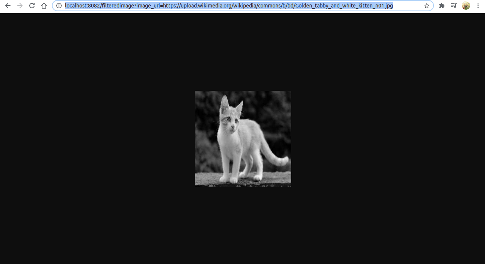
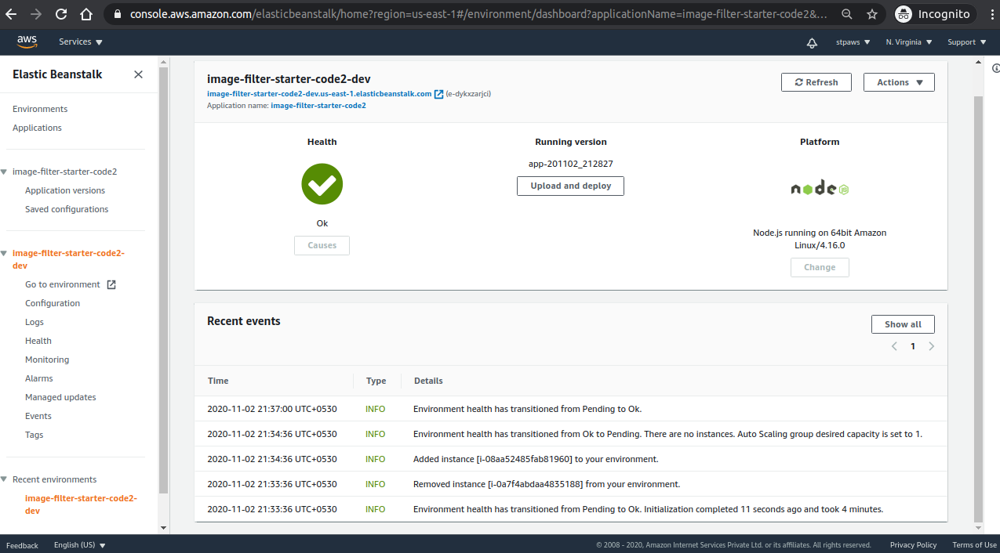
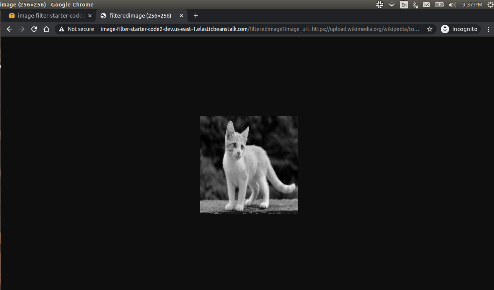

# Udagram Image Filtering Microservice

Provides utilities to input any image url, and resizes and makes it grayscale.

## Local Deployment screenshot

## Elastic Beanstack deployment

> Endpoint of the production app.

http://image-filter-starter-code2-dev.us-east-1.elasticbeanstalk.com/filteredimage?image_url=https://upload.wikimedia.org/wikipedia/commons/b/bd/Golden_tabby_and_white_kitten_n01.jpg
